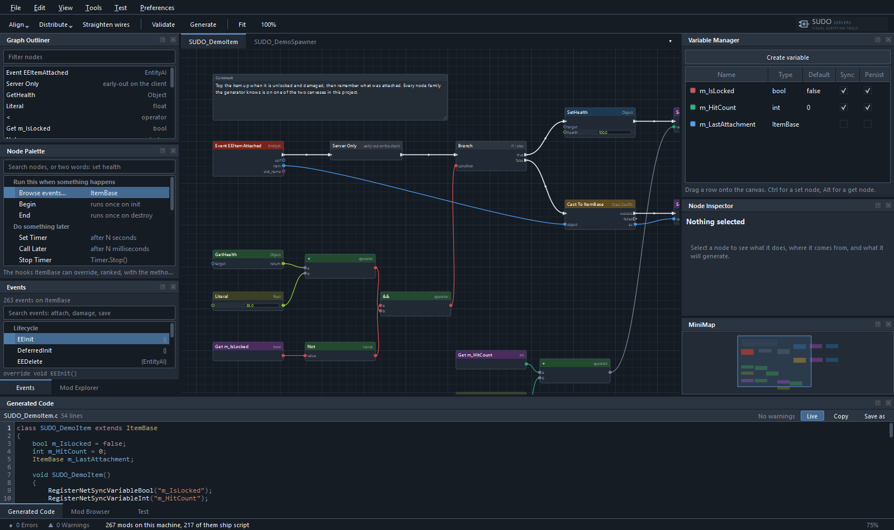
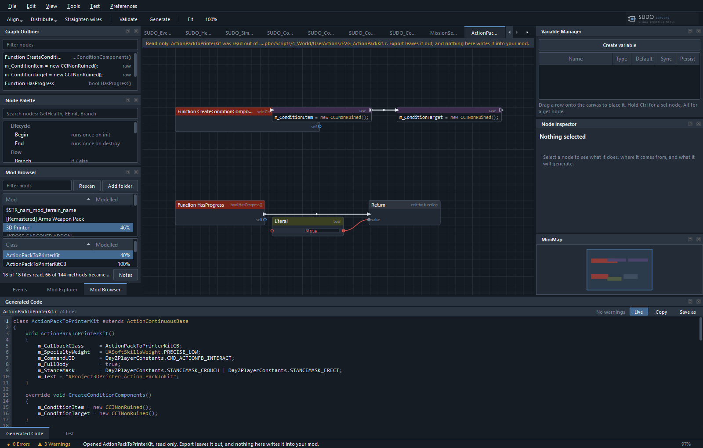

# SUDO DayZ Node Mod

Visual scripting for DayZ Enforce Script, in native Qt. Every vanilla class,
method, enum, global function and constant is a node, and the graph generates
Enforce Script you can compile.

It also reads. Point it at a mod you already have and its scripts open as
graphs, and what it writes back is the same file: byte for byte, line ending for
line ending. That is the whole design, and it is held down by a test suite
rather than by good intentions.



## What it is for

DayZ modding is Enforce Script, a C-like language with no public compiler, a
handful of undocumented traps, and a vanilla script tree of 2,780 files that you
are expected to already know. The usual way in is to find a mod that does
something close to what you want and read it.

This tool is the other way in. The palette is the whole vanilla API arranged by
what you are trying to do, so "run this after five seconds" is a node rather
than a `ref Timer` member, a construction, a `Run` call with a callback named by
a string nothing checks, and the method that string has to match. The file that
comes out is ordinary Enforce Script that anybody can read, edit and ship.

- **Nodes from the real API.** 6,108 classes, 29,024 methods of which 2,193 are
  events and 8,392 are pure, 403 enums, 362 global functions, 578 constants.
  Generated from the script tree on your own machine, not typed in by hand.
- **A palette organised by job.** 13 groups written as things you might be
  trying to do, ordered by how often each one appears in shipped mod code, with
  a fourteenth generated from whatever the other 13 do not name so no node can
  go missing. See [docs/node-reference.md](docs/node-reference.md).
- **The traps written on the node.** That a `Timer` member has to be `ref` or it
  is collected before it fires. That `Print` truncates at different lengths on
  the server and the client. That an offline run is not a server and cannot tell
  you whether your RPC works.
- **Warnings against your graph.** Correctness, DayZ traps and dead code, each
  with a code, shown on the node that caused it.
- **Your hand-written code survives.** Anything between the user-region markers
  in a generated file is carried across every regeneration, and there is a raw
  Enforce node for the lines a graph is the wrong shape for.

## The round trip

Opening somebody's script and writing it back has one bar, and it is the first
thing to check if you are deciding whether to trust this:

**A file this tool generated must come back byte for byte.** Not nearly. The
`importtest` suite reads every script it can find, turns each one into a graph,
generates a file from that graph and compares. A change that moves that count
off zero does not get merged, because a file whose line endings changed is a
file where every line changed, and one of those is a diff over somebody's whole
mod.

The consequence is that a method becomes nodes only when the generator can
reproduce it exactly. Anything else keeps its text in a raw node, visible and
labelled, rather than being half-recognised. On third party mod code 23% of
methods become node graphs today; on the author's own code it is 64%. Those
numbers are meant to go up, and they are printed by the suites rather than
claimed here.

## Reading mods you did not write

The mod browser opens the mods installed on this machine, reads their PBOs
without DayZ Tools, and shows each class as a graph. Browsed graphs are marked
read only, so nothing you look at can be written into your own mod by accident.



The PBO reader is native and was measured against the mods already on the
author's machine: 1,874 archives across 253 mods, 9,343,981 packed entries
decoded and checksum matched, 0 refused, 575.7 MB in 33.8 seconds. It was
cross-checked against `BankRev.exe` on 648 entries with 0 differences, and it
opens archives that `BankRev.exe` turns down.

`config.cpp` opens too, as a class tree with a property panel rather than as a
graph, because it is declarative. 243 of 243 configs on the work drive round
trip unchanged.

## Running your mod

The Test dock does the four things between a generated script and a character
standing in a test server: the `P:` junctions, the mod chain in the Workbench
project, the PBO, and the launch. It shows the command it ran and what came
back at every step, including when the step worked.

Offline and dev server are both first class. Offline is one process and comes up
in a fraction of the time; a dev server is the only one of the two that is
actually a server. The dock prints what an offline run cannot answer, each line
checked against the vanilla scripts or against the mod's own source.

## Installing

Windows only, and that is not an oversight: the application reads the Windows
registry and Steam library folders to find DayZ and DayZ Tools, and makes
junctions on the `P:` work drive.

| | |
| --- | --- |
| To edit graphs and generate script | the application, and `resources/catalog.json` |
| To build a PBO or launch a test | DayZ Tools, a mounted `P:` work drive, DayZ |

A release build is the executable, the Qt libraries beside it and the
`resources` folder. Unpack it anywhere and run `DAYZSUDONodeMod.exe`. Qt is
dynamically linked, so the Qt DLLs beside the executable can be replaced with
your own build of the same major version. That is a licence obligation as much
as a feature, and [THIRD-PARTY-NOTICES.md](THIRD-PARTY-NOTICES.md) says why.

The node catalogue at `resources/catalog.json` is generated from the DayZ script
tree by `tools/build-catalog.mjs`. The application will not start without it and
says so. What a release is allowed to ship is covered in
[THIRD-PARTY-NOTICES.md](THIRD-PARTY-NOTICES.md).

## Building from source

Qt 6.11 with the MinGW 13.1 toolchain, CMake 3.16 or newer, Ninja, C++17. Qt
Core, Gui, Widgets and Network, nothing else. Network is there for the update
check and nothing else reaches it.

```
cmake -S . -B build/cli -G Ninja -DCMAKE_PREFIX_PATH=C:/Qt/6.11.0/mingw_64 -DCMAKE_CXX_COMPILER=C:/Qt/Tools/mingw1310_64/bin/g++.exe
cmake --build build/cli
build/cli/DAYZSUDONodeMod.exe resources/SUDO_Link.sdzn
```

Close the application before you build. A running `DAYZSUDONodeMod.exe` holds
its own binary open, the link fails, and the test targets are then read off a
stale build that still passes.

There are 19 test suites and they all run headless.
[CONTRIBUTING.md](CONTRIBUTING.md) has the full build and test instructions, the
round trip bar a change has to meet, and the house style.

## Where to go next

| | |
| --- | --- |
| [docs/getting-started.md](docs/getting-started.md) | From an empty window to a mod loaded in a test server |
| [docs/examples/](docs/examples/) | Four worked examples with the script each one generates |
| [docs/node-reference.md](docs/node-reference.md) | What the node families are and when to reach for each |
| [docs/architecture.md](docs/architecture.md) | How it works, for somebody who wants to change it |
| [DESIGN.md](DESIGN.md) | The interface contract: docks, theme, node spec, interaction |
| [CHANGELOG.md](CHANGELOG.md) | What is in this release |
| [docs/notes/](docs/notes/) | Working notes and research kept for the record |

## Licence

MIT, in [LICENSE](LICENSE). Copyright 2026 Dillan Stephenson.

This application uses the Qt framework under the GNU Lesser General Public
License version 3, dynamically linked. Third party components, what a release
redistributes and what each licence asks for are set out in
[THIRD-PARTY-NOTICES.md](THIRD-PARTY-NOTICES.md).

DayZ, Enfusion and Bohemia Interactive are trademarks of Bohemia Interactive
a.s. This project is not affiliated with or endorsed by Bohemia Interactive.
