# Getting started

This is the long road, written for somebody who mods DayZ but has never written
Enforce Script. If you have edited a `types.xml` and copied somebody's
`config.cpp`, you know enough to follow it. Nothing else is assumed. Where a step
can go wrong, this says what it looks like when it does.

By the end you will have a mod folder on disk, a `.pbo` the game can load, and a
line of your own text in a DayZ log.

## The road, in one screen

| | Step | You know it worked when |
| --- | --- | --- |
| 1 | [Install and first run](#3-install-and-first-run) | The start page opens and asks about update checks |
| 2 | [Mount the work drive](#the-work-drive) | `P:` exists in Explorer |
| 3 | [Create the mod](#51-create-the-mod) | A mod folder on disk, and `P:\<Prefix>` beside it |
| 4 | [Add a script](#52-add-the-script) | A tab with your class name, and one red event node on the canvas |
| 5 | [Wire three nodes](#53-wire-three-nodes) | The Generated Code dock shows a `Print` line |
| 6 | [Export the scripts](#55-write-the-files) | A `.c` file in the mod folder, on disk |
| 7 | [Build the PBO](#56-build-the-pbo) | `P:\Mods\@<Prefix>\Addons\<Prefix>.pbo` exists |
| 8 | [Launch and read the log](#57-launch-and-find-your-line) | Your text in `Profiles\Client\script_*.log` |

Skipping a step does not usually produce an error. It produces a mod that loads
and does nothing, which is a much slower way to find out. Steps 6, 7 and 8 have
to happen in that order every time you change the graph.

---

## 1. What this is, and what it is not

DayZ mods are written in Enforce Script, a C-like language with no public
compiler and a vanilla script tree of about 2,800 files you are expected to
already know. This tool turns that tree into nodes: you place an event, wire what
happens after it, and it writes Enforce Script. The file it writes is ordinary
`.c` that anybody can read, edit in Notepad, put in git and ship. It is not a
runtime, not a wrapper and not a format of its own, so if you stop using this
tool tomorrow your mod keeps working and you keep editing it by hand. That is
worth knowing before you invest an evening in it.

What it is not:

- **Not a compiler.** Nothing here proves your script compiles. The game does
  that. A graph can be valid and still be wrong.
- **Not a mod manager.** It does not subscribe, publish or upload anything.
- **Not a substitute for reading vanilla.** It puts the vanilla API in front of
  you and writes the traps on the nodes, and that is as far as it goes.
- **Not able to stop you calling the wrong hook.** It warns where it can. Some
  mistakes only show up as a mod that loads and sits there.

Two things it does that are worth the trouble on their own. It opens mods you did
not write and shows them as graphs, which is the fastest way to learn DayZ
modding. And a file it generated comes back byte for byte when it reads it again,
so opening a script to look at it never rewrites it under you.

---

## 2. What you need before you start

| | Needed for |
| --- | --- |
| Windows | Everything. The application reads the registry and Steam library folders, and makes junctions on `P:` |
| The application and its `resources` folder | Everything. It will not start without `resources/catalog.json` |
| DayZ | Launching a test |
| DayZ Tools (free, on Steam) | Packing a PBO, and the diag executable a test runs |
| A mounted `P:` work drive | Packing a PBO, and launching |

You can wire graphs and generate script with nothing but the application. The
last three are for the half of the loop that puts the mod in the game.

### The work drive

DayZ's tools resolve every path through one drive letter, `P:`. Binarize,
AddonBuilder and Workbench all do it. A mod folder that is not reachable at
`P:\<YourPrefix>` cannot be packed at all, whatever else is correct.

`P:` is not a real disk. It is a folder on your disk given a drive letter.
Opening DayZ Tools mounts it. If you would rather not open DayZ Tools, the same
thing is one line in a command prompt:

```
subst P: C:\DayZ_WorkDrive
```

Either way it does not survive a reboot, so this is a thing you will do again.
The application checks and tells you which of the two problems you have: the
drive is not mounted, or the drive is mounted and your mod is not linked into it.

The link itself is made for you. A mod created with **File > New mod...** is
junctioned as part of being created, and for a mod folder that already exists
there is **Set up work drive** in the Test dock, `Ctrl+Shift+P`.

**Do not create your mod on `P:` itself.** It looks like the tidy thing to do and
it cannot work: the mod folder would have to take the exact name its own junction
needs, so no link can be made, and AddonBuilder is handed a path to a folder that
is not there. The New mod dialog refuses before it writes anything and says so:

> A mod created directly on P:\ takes the name its own work drive link needs, and
> then it cannot be built. Pick a folder outside the work drive.

Put the mod somewhere ordinary, like `C:\Users\<you>\Documents\DayZ Projects`,
and let `P:` point at it.

Two other things the application refuses, both on purpose:

- **A prefix the work drive already uses.** `DZ` and its neighbours hold the
  game's own unpacked data. A junction with one of those names shadows vanilla,
  and the failure it produces looks like nothing to do with you.
- **Deleting anything.** If a real folder is already sitting at `P:\<Prefix>`, it
  stays exactly where it is. The application offers to rename it aside only after
  it has compared it against your mod folder and found nothing in it that your
  mod folder does not already have.

---

## 3. Install and first run

A release is a ZIP holding `DAYZSUDONodeMod.exe`, the Qt libraries beside it, and
a `resources` folder. There is no installer. Unpack it anywhere you can write to
and keep the three together: the application looks for `resources/catalog.json`
next to itself, and refuses to start without it. A ZIP unpacked into
`C:\Program Files` will fight you over permissions later, so pick somewhere else.

Run `DAYZSUDONodeMod.exe`. A splash comes up while the node catalogue loads,
which takes a second or two, then the start page.

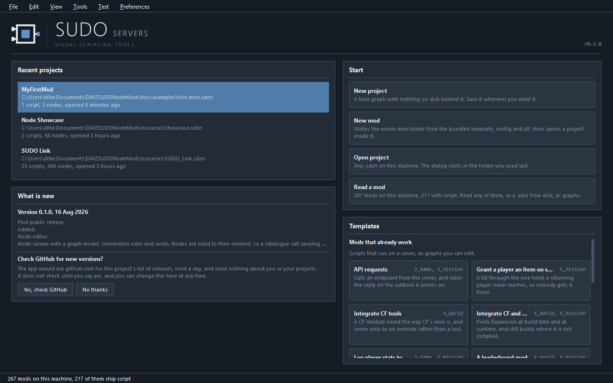

Four ways in, on the right:

| | |
| --- | --- |
| New project | A bare graph with nothing on disk behind it |
| New mod | The whole mod folder from the bundled template, then a project inside it |
| Open project | Any `.sdzn` on this machine |
| Read a mod | Any of the mods installed on this machine, or a loose `.pbo` |

**New mod** is the one to pick if you are starting from nothing. It is the only
one that leaves you with something the game can load.

Under **Templates**, in a panel that scrolls, are three groups. **Mods that
already work** are whole scripts that do the job on a server, as graphs you can
edit. **Empty starts** are three class headers with nothing in them. **To read**
is shipped work opened to look at. They are worth going through later. For now,
the first mod below is built by hand, because the point is to see what each part
does.

### The update question

On a fresh install the What is new panel asks one question and does nothing until
you answer it:

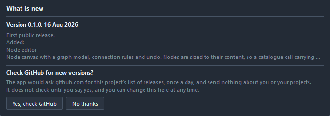

Nothing is sent anywhere until you say yes, and what it sends when you do is a
request to github.com for this project's list of releases, once a day. It sends
nothing about you or your projects. **No thanks** is remembered, and there is a
**Turn checks on** button in the same place if you change your mind. This is a
tool you got from a mod community, so it asks rather than assumes.

**You know this step worked when** the start page is on screen and the status bar
at the bottom says how many mods it found on your machine.

---

## 4. A tour of the window

Open anything, or press **New project**, and the start page is replaced by the
editor. Ten docks around a canvas, a toolbar and a status bar. You will use four
of them at first.

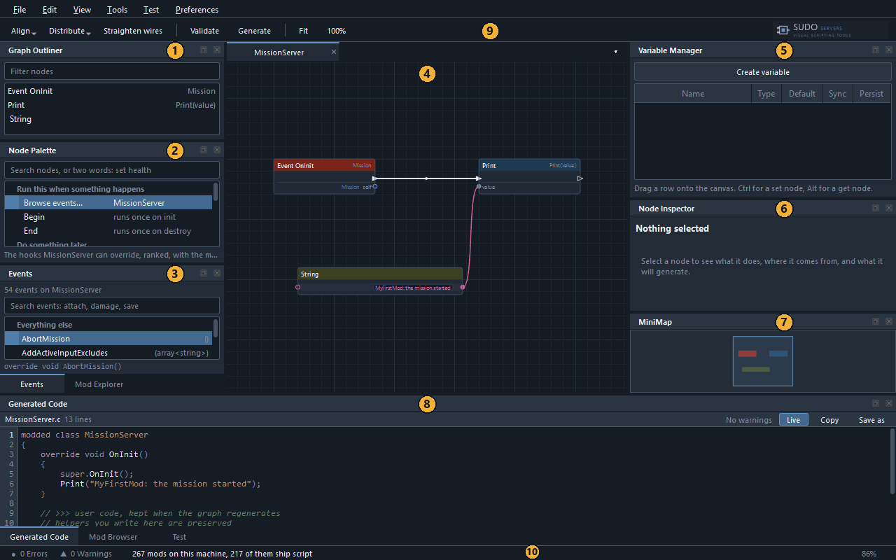

| | Panel | What it is for |
| --- | --- | --- |
| 1 | Graph Outliner | Every node in this graph as a list. Click a row to find the node on the canvas |
| 2 | Node Palette | Everything you can place, grouped by what you are trying to do, with a search box |
| 3 | Events, and Mod Explorer behind it | The hooks this class can override, and the files in your mod folder |
| 4 | The canvas | The graph. Nodes and the wires between them |
| 5 | Variable Manager | The values this class remembers between calls |
| 6 | Node Inspector | What the selected node does, where it comes from, and what it will generate |
| 7 | MiniMap | Where you are in a graph too big for the screen |
| 8 | Generated Code, with Mod Browser and Test behind it | The file this graph writes, somebody else's mod, and running yours |
| 9 | The toolbar | Align and distribute nodes, straighten wires, Validate (`F8`), Generate (`F7`), zoom |
| 10 | The status bar | Error and warning counts, and the last thing that happened |

Three of those are tabs stacked behind other tabs. **Mod Explorer** shares the
bottom of the left column with **Events**. **Mod Browser** and **Test** share the
bottom row with **Generated Code**. Click the tab name to bring one forward. Every
panel can also be closed and reopened from the **View** menu, and dragged
somewhere else if you prefer it there.

The two you cannot ignore are the canvas and the Generated Code dock under it.
They are the same thing seen two ways, and the second one is the answer to "what
is this actually doing".

---

## 5. Your first mod

The mod: when the server mission starts, write one line of your own into the log.

That is deliberately small. It is also the only kind of first result worth
having, because you can prove it with your own eyes in under a minute. A mod that
changes a stat by 4% is a mod you cannot tell apart from a mod that did not load.

### 5.1 Create the mod

**File > New mod...**, or `Ctrl+Shift+N`. Four fields and a checkbox, and the
dialog shows you the folder it is about to write before it writes anything.

| Field | What it becomes | For this walkthrough |
| --- | --- | --- |
| Mod prefix | The folder name, the `CfgPatches` class name, the PBO name, and the junction on `P:` | `MyFirstMod` |
| Display name | What the launcher shows. Filled in from the prefix until you type over it | `My First Mod` |
| Author | Written into `config.cpp` | your name |
| Location | The folder the mod folder is created in | `Documents\DayZ Projects`, or anywhere off `P:` |

The prefix has to start with a letter and hold only letters, digits and
underscores, because it has to survive being a class name, a folder name and a
PBO name at once. `ModTemplate` is refused: that is the token the template
replaces.

**Tick Include a mission and pick one map.** The map list holds
`ChernarusPlus`, `Enoch` and `sakhal`, and it is greyed out until the checkbox is
on. Missions are off by default and most mods do not ship one, but the offline
test run below loads a mission out of your own mod folder and refuses to start
without one. `ChernarusPlus` is the usual choice. If you skip this you can still
use the dev server, and the offline button will tell you exactly what is missing.

Press **Create mod**. Abridged, what you get:

```
MyFirstMod\                      the mod folder, and MyFirstMod.sdzn lives here
  MyFirstMod\                    the addon folder, and what P:\MyFirstMod points at
    Scripts\
      config.cpp                 CfgPatches and CfgMods, with your name in them
      1_Core\MyFirstMod\
      3_Game\MyFirstMod\
      4_World\MyFirstMod\
      5_Mission\MyFirstMod\      your script goes here
    Workbench\                   dayz.gproj, project.cfg, server.cfg
  Missions\
    MyFirstMod.ChernarusPlus\    the mission the offline run loads
  Profiles\                      Client\ and Server\ appear here on the first run
  Addons\                        empty, and not where the PBO lands
  MyFirstMod.sdzn                the project you just made
```

There is more than that in the folder: a `README.md`, an `Init.ps1` and a
`SetupWorkdrive.bat` the template carries, and a `stringtable.csv` and an
`Inputs.xml` beside `config.cpp`. None of them are in your way.

Those four numbered folders are DayZ's script modules, and they compile in that
order: `1_Core`, then `3_Game`, then `4_World`, then `5_Mission`. Which one a
script lives in decides what already exists when it runs. Items and players are
declared in `4_World`. The mission is `5_Mission`.

**The junction goes on the inner folder, not the outer one.** `P:\MyFirstMod`
opens `MyFirstMod\MyFirstMod`, the one holding `Scripts` and `Workbench`, because
that is the folder AddonBuilder and Workbench are pointed at. The outer folder,
with `Missions` and the `.sdzn` in it, is yours and is not on the work drive at
all. That is worth knowing the first time you go looking on `P:` for a file you
just saved.

**You are already in the editor, on a tab called `MyFirstMod`.** Creating a mod
leaves you with a project holding one empty script named after it. Leave it
alone for now. It comes back in [5.5](#55-write-the-files), because Export
scripts writes it out along with the one you are about to make.

**You know this step worked when** the folder above exists, and `P:\MyFirstMod`
opens `Scripts` and `Workbench` in Explorer. If `P:` was not mounted, the report
says so and you can link it later with **Set up work drive**.

### 5.2 Add the script

A script is one class in one file.

Click the **Mod Explorer** tab at the bottom of the left column. It is rooted on
the outer mod folder, so `Addons`, `Missions`, `Profiles` and the inner
`MyFirstMod` are what you see first. Open the inner one and keep going:

```
MyFirstMod  >  Scripts  >  5_Mission  >  MyFirstMod
```

Right-click that last folder and choose **New script...**. There is a **New
file...** under it, which makes an empty file and opens it as text. That is not
this.

| Field | Set it to |
| --- | --- |
| Class name | `MissionServer` (this names the file, `MissionServer.c`) |
| Starts as | Modded class (already chosen, because the folder is `5_Mission`) |
| Modded class | `MissionServer` (already filled in, for the same reason) |

So the only thing to type is the class name. A **modded class** reopens a class
the game already has, rather than declaring a new one. That is how nearly all
DayZ modding works: you do not replace `MissionServer`, you add to it. The
dialog shows a preview of the file it is about to write, and names the exact
path underneath.

The preview is not empty, and this matters in a minute:

```c
modded class MissionServer
{
	override void OnInit()
	{
		super.OnInit();
	}
}
```

Press **Create script**. That file is written to disk, and it opens as a graph.

**You know this step worked when** the tab says `MissionServer`, the Generated
Code dock at the bottom says `MissionServer.c`, and there is **one red node
already on the canvas**, called Event OnInit. That node is the `override void
OnInit()` above, read back off the file. The canvas is not blank and is not
meant to be.

### 5.3 Wire three nodes

Three nodes: the event that fires, the thing that happens, and the text it says.
You have the first one already.

**The event is on the canvas.** **Event OnInit**, red, from the skeleton the
last step wrote. Use that one, and do not place a second.

Two event nodes for the same method generate one method between them, and the
one that wins may be the empty one, so the whole of your graph comes out as a
method that does nothing. The Events panel will not let you: ask it for a hook
the graph already has and it selects the one you have and says
"Event OnInit is already on this graph." The **Node Palette** and the
right-click search are not so careful. Both list events too, and both will place
a second one without a word. If you have done that, the code dock says
`1 warning` where it usually says `No warnings`, the **Graph Outliner** shows two
rows called Event OnInit, and the fix is to click the spare one and press
`Delete`.

The node's top right corner says `Mission`, not `MissionServer`. That is the
class the hook is declared on. `MissionServer` is further down the same chain
(`MissionServer` to `MissionBase` to `MissionBaseWorld` to `Mission`), which is
why the hook reaches it, and the override the tool writes still goes on
`MissionServer`.

The **Events** panel on the left is where an event comes from when you do not
already have one: it lists the hooks the class you are in can override, 54 of
them here, with a search box. You will use it in your next mod. Two other ways
to get a node onto the canvas, both worth knowing now:

- **Right-click empty canvas** for the add-node search at that point.
- **Drag a wire off any pin and let go on empty canvas** for the same search,
  filtered to nodes that can take what you dragged.

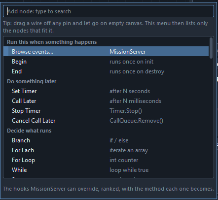

**Place the Print node.** Right-click to the right of the event, type `print`,
and pick **Print** from the group called "See what it is doing". The same search
lives permanently in the Node Palette:

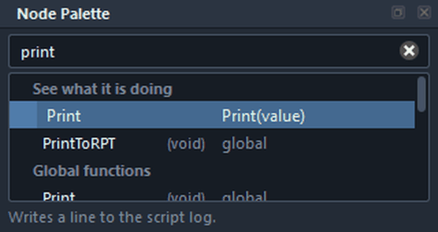

**Place the text.** Right-click below and type `string`. **Read this list before
you press Return.** The first row is **Literal**, under "Work out a value",
which is a different node: it takes whatever type you point it at. The one you
want is **String**, one group down under "Everything else", with `Literals` in
its right hand column. Pick that one. Click its box and type something you will
recognise in a log file:

```
MyFirstMod: the mission started
```

**Wire it up.** Two wires, and they are different kinds.

| From | To | What kind |
| --- | --- | --- |
| Event OnInit `exec` (the white triangle on its right edge) | Print `exec` (the white triangle on its left edge) | exec |
| String `ret` (the round pin on its right edge) | Print `value` (the round pin on its left edge) | data |

Drag from one pin and let go on the other. A wire that is not allowed will not
connect.

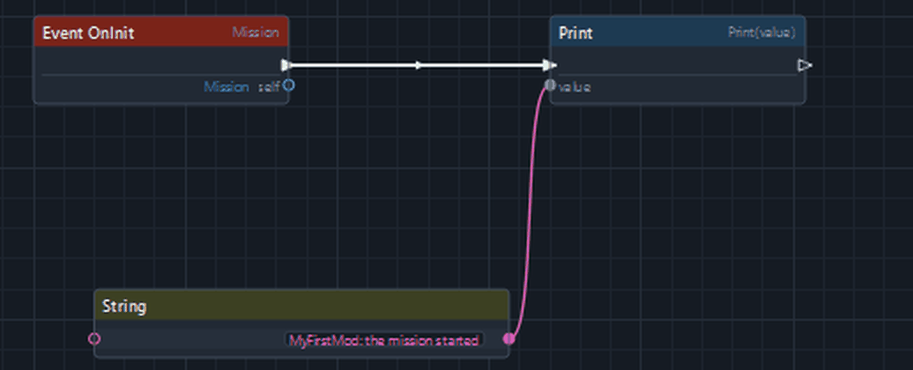

That is the whole mod. [Section 6](#6-what-you-just-used) explains what the two
wire kinds and the pin colours mean, now that you have seen them.

**You know this step worked when** the Generated Code dock says `13 lines` and
`No warnings`, shows a `Print` line, and the status bar says 0 errors and 0
warnings.

### 5.4 Read the code beside the graph

The Generated Code dock is not a preview. It is the file, updated as you edit.

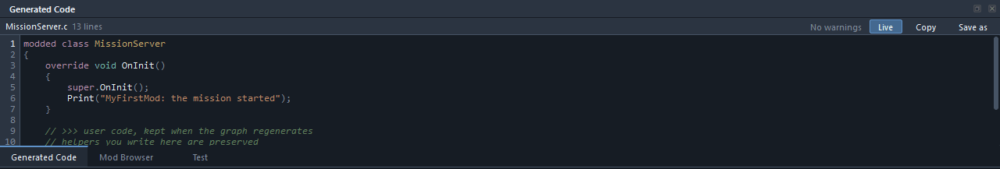

The whole of it:

```c
modded class MissionServer
{
	override void OnInit()
	{
		super.OnInit();
		Print("MyFirstMod: the mission started");
	}

	// >>> user code, kept when the graph regenerates
	// helpers you write here are preserved
	// <<< user code
};
```

Read it against the graph. `modded class MissionServer` is the reopen. `override
void OnInit()` is the event node. `super.OnInit();` was written for you and is
not a node you placed: leaving `super` out of a reopened class silently drops
everything the base class and every other mod did in that method, so it is not
left to memory. `Print(...)` is the Print node, and the string inside it came down
the data wire.

The last three lines are the user region. Anything you type between those two
markers is read back and put in again every time the file is regenerated, so a
helper you write by hand is not thrown away by the next export.

Click a line in the code and the node that produced it is selected. Click a node
and its lines are marked. Here the Print node is selected, and you can see it
picked out in four places at once:

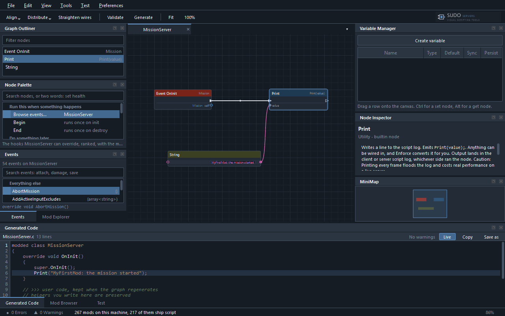

The **Node Inspector** on the right is where a node explains itself: what it
does, what it will generate, and the cautions it carries. Reading it is the
fastest way to learn what a node is for.

**Validate**, or `F8`, runs the checks over the whole graph: dangling inputs, type
mismatches, DayZ traps and dead code. The counts land in the status bar and the
problems land on the nodes that caused them. Run it before every export.

### 5.5 Write the files

**Your edits are not on disk yet.** `MissionServer.c` is there, because 5.2
wrote it, but what is in it is the four line skeleton. The Print is in the graph
and in the code dock, and the code dock is live, so everything looks current
while the file on disk is a version old. This is the step people skip, and
skipping it produces a mod that loads and does nothing, because the PBO is
packed from the file and not from the graph.

Three things look like they write it, and one of them is the one to use:

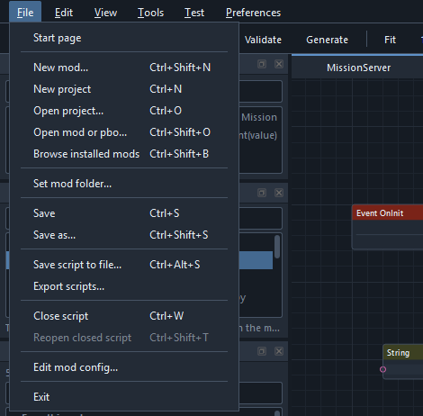

- **Generate** on the toolbar, and **Tools > Generate Enforce Script** (`F7`),
  show you the code in a window. They write nothing.
- **File > Save script to file...** (`Ctrl+Alt+S`) writes the script you are
  looking at, wherever you point it. Useful later, and easy to point somewhere
  that is not your mod.
- **File > Export scripts...** writes every script in the project, each one back
  where it belongs. This is the one.

Export scripts names the folder it is about to write into and asks before it
writes. Scripts that came from a file go back to that file; the rest go into
your mod's `Scripts` folder under the right module. Anything opened out of
somebody else's mod is never written anywhere.

Here that question reads roughly "Write 1 scripts to ...\MyFirstMod\Scripts",
and under it, "1 more go back to the files they were opened from." The one going
back to its own file is your `MissionServer.c`. The one going into the Scripts
folder is `MyFirstMod`, the empty script the New mod step left in the project,
and it lands at `Scripts\4_World\MyFirstMod.c` as

```c
class MyFirstMod
{
	// add an Event node and chain nodes from its exec pin
};
```

Press **Export here**. An empty class declares a name and does nothing, so it
costs you nothing to ship; if you would rather not have it, close its tab with
`Ctrl+W` first, which takes the script out of the project.

Press **File > Save** as well, or `Ctrl+S`, to keep the project itself.

**You know this step worked when**
`MyFirstMod\MyFirstMod\Scripts\5_Mission\MyFirstMod\MissionServer.c` exists on
disk and holds the code above, `Print` line included. Open it in Notepad and
check for the Print. Doing that once is worth it: this is the point where the
thing stops being a diagram and becomes a DayZ mod.

### 5.6 Build the PBO

The **Test** dock is behind Generated Code at the bottom of the window. Click the
**Test** tab to bring it forward, or press one of the actions below and it comes
forward by itself. The same actions are on the **Test** menu, which is the easier
place to read them:

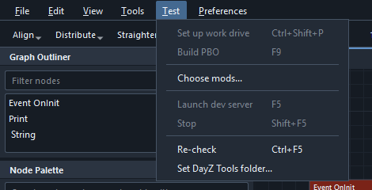

That picture is the menu on a bare project, which is what it looks like before a
mod folder is set. On your mod every line is available. The fourth line changes
its own name with the selector in the dock, so it says either Launch offline or
Launch dev server.

| Action | Shortcut | What it does |
| --- | --- | --- |
| Set up work drive | `Ctrl+Shift+P` | Junctions the mod folder to `P:` |
| Build PBO | `F9` | Writes the mod chain into the Workbench project, then packs the mod |
| Choose mods... | | Loads other installed mods beside yours for one run |
| Launch offline / Launch dev server | `F5` | Starts the test |
| Stop | `Shift+F5` | Kills what this application started, server first |
| Re-check | `Ctrl+F5` | Re-reads the prerequisites |
| Set DayZ Tools folder... | | For a machine where the registry key is not set, which is common |

Press **Build PBO**. It runs AddonBuilder over the folder holding `config.cpp` and
puts the result in `P:\Mods\@MyFirstMod\Addons`, which is the only place the
engine looks for a mod that did not come from the Workshop.

The dock prints the command it ran and everything that came back, including when
the step worked. A build that failed with nothing on screen is the thing that
costs an evening, so nothing is swallowed.

Under the buttons and the selector is a checklist, eleven rows, in this order:
Mod folder, Work drive, Vanilla data, Work drive link, AddonBuilder, Diag build,
Mod chain, Workbench project, Server config, Mission, Built PBO. Each row reads
ok, check or missing in its first column, names what it found in the third, and
hovering it says what to do about it. Every row is always there, so a short dock
scrolls rather than hiding any of them. If a button is greyed out, the checklist
is where the reason is. Read it top to bottom the first time: it is the whole of
what this application needs from your machine.

**You know this step worked when** `P:\Mods\@MyFirstMod\Addons\MyFirstMod.pbo`
exists, with today's timestamp. Check the timestamp, not just the file: a PBO
from an hour ago is the most convincing way to test the wrong code.

### 5.7 Launch and find your line

The **Run** selector in the Test dock, on the row under the buttons, chooses
between two runs that are not interchangeable. It starts on **Dev server**, so
change it to **Offline**. The button beside it renames itself. Press **Launch
offline**, or `F5`.

Offline is one `DayZDiag_x64.exe` on your mod's own mission. It comes up in a
fraction of the time a server does, which is what you want while a script is
changing every few minutes. It loads
`MyFirstMod\Missions\MyFirstMod.ChernarusPlus`, which is why the New mod dialog
needed a map ticked.

Both runs use `DayZDiag_x64.exe`, which DayZ Tools installs into your DayZ folder,
and both pass `-filePatching`, because a script mod cannot be loaded from loose
files without it. The retail `DayZ_x64.exe` and `DayZServer_x64.exe` both stop at
the loading screen once file patching is on, so neither is used here.

Both also pass `-window`, so DayZ comes up in a window rather than taking the
screen. That is on purpose: a test session is something you watch with the log
beside it.

Wait for the game to reach the world, then press **Stop**, or `Shift+F5`.

Now the log. Open:

```
MyFirstMod\Profiles\Client\
```

There is a `script_<date>_<time>.log` in there, newest last. Open it and search
for your text. It is on a line that looks like this:

```
SCRIPT       : MyFirstMod: the mission started
```

That is your mod running. `Print` writes to the script log of whichever side ran
it: offline that is the client profile above, and on a dev server the server's
own line lands in `Profiles\Server\` instead, because the two processes keep
separate profile folders on purpose. Sharing one means two processes writing the
same log, and the one you need is the one that gets overwritten.

**If the line is not there,** go to [section 9](#9-when-it-goes-wrong). The order
of the questions there matters: the usual answer is that the export or the build
did not happen, not that the script is wrong.

### The loop from here

Every change you make from now on is the same four steps in the same order:

```
edit the graph  ->  Export scripts  ->  Build PBO  ->  Launch
```

Two of those are easy to skip and neither tells you off for it.

---

## 6. What you just used

Everything in this section was on screen in the last one. It is worth naming now.

### Exec wires and data wires

Two kinds of pin, and they never connect to each other.

**Exec pins are triangles.** They decide the order statements run in. A chain of
exec wires is a list of lines in the generated method, top to bottom. In your
graph, the single exec wire from the event to the Print node is what put
`Print(...)` inside `OnInit()`. Unwire it and the Print node still exists and
generates nothing, because nothing runs it.

**Data pins are circles.** They carry values. The pink wire from the String node
into Print's `value` pin is what put the text inside the brackets. A data wire
does not run anything: it says where a value comes from when the statement that
needs it runs.

An input data pin takes one wire. An output can feed as many as you like. An
unconnected data input draws a box you can type into, which is why a graph with
nothing wired still generates something that compiles.

### Why pins have colours

The colour is the type, and the same colour means the same type everywhere.
There are eight of them:

| Colour | Type |
| --- | --- |
| Red | `bool` |
| Green | `int` |
| Yellow-green | `float` |
| Pink | `string` |
| Amber | `vector` |
| Blue | an object, of whatever class |
| Purple | an enum |
| Light green | a `typename` |

It is not decoration. Enforce is typed, and the canvas refuses a wire the
compiler would reject rather than generating it. Three rules cover nearly
everything you will hit:

- **`int` and `float` connect to each other.** Nothing else crosses colours, so a
  `string` will not go where a `float` is wanted.
- **Blue to blue still has to make sense.** Two object pins connect only when one
  class really is the other, checked against the vanilla inheritance chain. When
  they are not, the canvas says so and tells you to put a Cast node between them.
- **A grey pin takes anything.** Print's `value` is one, which is why your String
  went into it without a fuss.

When you drag a wire into empty canvas, the search that opens is filtered to
nodes with a pin that would accept it:

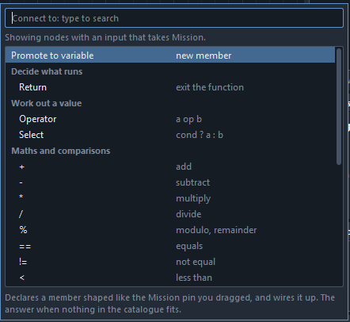

That is the fastest way to work when you do not know the name of what you want.
Drag from the pin you have and read what will accept it.

### Events

An event node is an override, and nothing else. It is the moment your code runs.

The Events panel lists only the hooks the class you are in actually inherits,
because taking one from an unrelated class would generate a method with the right
name on the wrong class, which compiles and is never called. That is the single
most expensive mistake in DayZ modding and it is covered again in section 9.

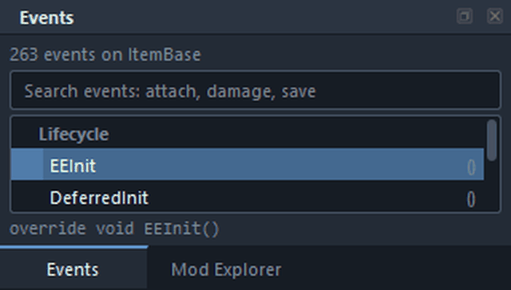

The list is ranked rather than alphabetical: six named groups, Lifecycle first,
then Attachments and cargo, Damage and death, Persistence, Player interaction and
Frame and update, with everything else alphabetical underneath. Nothing is
hidden, so an event nobody ranked is still in there.

The ranking was written for entities, which is where most mods start, so on an
item class it earns its keep and on other classes it does less. On the
`MissionServer` you used in section 5, every one of the 54 rows is under
Everything else, `OnInit` included. That is not the panel giving up on you: it
is a list of 54 rather than 263, and the search box is above it. Use the search
box whenever you know part of the name.

The count at the top is real: `ItemBase` has 263 of them. You will use a handful.

### Variables

A variable is a value the class remembers between calls. Declare it in the
**Variable Manager** first, and its Get and Set nodes come from there, because
they only exist in this graph.

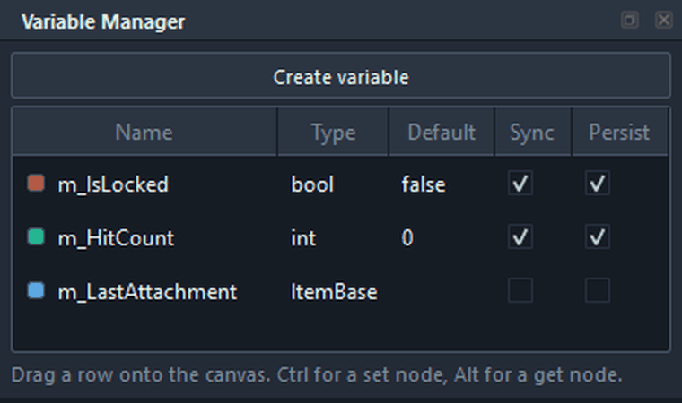

Drag a row onto the canvas and it asks whether you want to read the variable or
write it. Hold Ctrl while you drop for a Set node, or Alt for a Get node, and it
skips the question. Two columns are DayZ-specific and worth understanding before
you tick them:

- **Sync** registers the variable to be sent to clients. A synced variable only
  actually reaches them after something calls `SetSynchDirty`, which is a node of
  its own. Ticking Sync and forgetting that is a variable that is right on the
  server and stale everywhere else.
- **Persist** writes the value into the item's saved state, so it survives a
  server restart.

### The palette

The Node Palette holds every vanilla class, method, enum, global function and
constant as a node, arranged by what you are trying to do rather than by which
engine class a method happens to sit on. "Run this when something happens" is
first because that is where nearly every graph starts.

The search box takes two words, in either order and with the gaps left out:
`config get` brings up `ConfigGetText`, `ConfigGetChildName` and the rest of that
family under "Read a config value". When you do know the name, type it. When you
do not, read the group names. **Read the whole shortlist before you press
Return**, because the highlighted first row is a guess and not always the right
one, which is how the String node in section 5 catches people.

[node-reference.md](node-reference.md) is the same list on a page, with the
cautions each node carries.

---

## 7. Reading somebody else's mod

The fastest way to learn DayZ modding is to read a mod that already does
something close to what you want. That is what the Mod Browser is for. Press
`Ctrl+Shift+B`, or **File > Browse installed mods**.

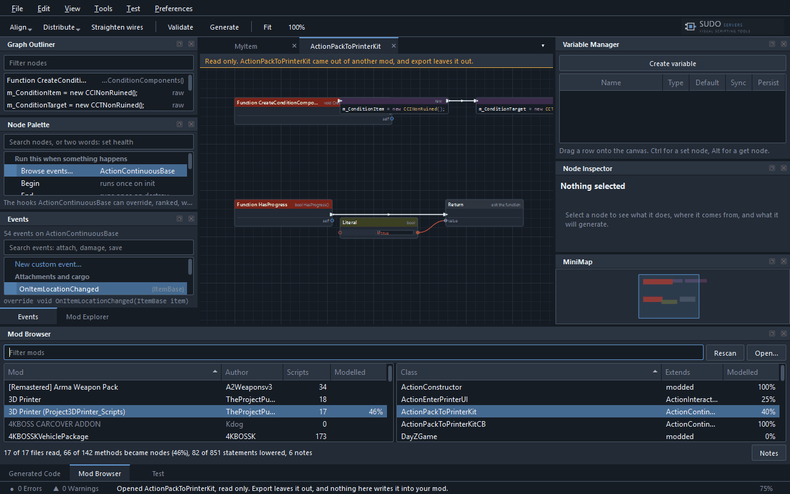

The left list is every mod on this machine. The right list is the classes in the
one you picked, with what each class extends. Double-click a class and it opens
as a graph.

**Everything you open here is read only.** The bar across the top of the canvas
says so, export leaves it out, and nothing in it can be written into your own mod
by accident. Look at whatever you like.

The line along the bottom is the honest part. For the mod in that picture:

```
17 of 17 files read, 66 of 142 methods became nodes (46%), 82 of 851 statements lowered, 6 notes
```

**Most of what you open will be raw text nodes, and that is on purpose.** A
method becomes a graph only when regenerating it reproduces the original file
exactly. Anything else keeps its text in a raw node, visible and labelled:

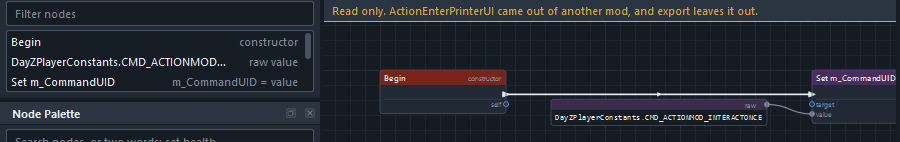

The alternative would be guessing, and a wrong guess is worse than text: it would
mean looking at a graph that says one thing while the file says another. So a
class showing 25% in the Modelled column is not broken, and it is not a class the
tool failed on. It is a class where a quarter of the methods became graphs and
the rest are shown as the source they really are. The percentage is printed
rather than hidden so you always know which you are looking at.

`config.cpp` opens too, as a class tree with a property panel rather than as a
graph, because it is a list of settings rather than a list of steps.

---

## 8. Testing

Two ways to run, and the difference between them is not speed.

### Offline

One process on your mod's own mission. Comes up fast, so it is the loop to use
while a script is changing.

The Test dock names, on the line under the selector, what an offline run cannot
answer, and writes the same list with its reasons into its log the moment you
choose Offline. Hovering the line shows the reasons too. Every one was checked
against the vanilla scripts:

- **Another player.** One process, one character.
- **Anything networked.** `IsMultiplayer()` is false offline, and vanilla gates
  467 checks across 197 files on it, RPC delivery included.
- **A variable written on the wrong side.** `EntityAI.IsServerCheck` only raises
  its error for a multiplayer client, and offline is not one.
- **Code behind `IsDedicatedServer()` or `#ifdef SERVER`.** Offline is neither.
- **Anything set in `server.cfg`.** Offline passes no `-config`, so
  `ServerConfigGetInt` finds nothing and `cfggameplay.json` is not loaded.

A sixth line appears when the mod chain has a server-only mod in it, and a
seventh when it has Community Online Tools. That last one deserves saying twice,
because it fails in the direction that hurts. **If you load Community Online
Tools, permissions offline fail open, not closed.**
`HasPermission` returns true whenever the mission is offline, and roles
are only loaded on a multiplayer server. So a feature you gated behind a
permission works perfectly on your machine, and can lock every player out on the
real server. A permission-gated feature is not tested until it has been tested on
a dev server.

### Dev server

Two processes: a diag server first, then a diag client connecting to it once the
port is open. This is the only one of the two that is actually a server. Slower to
start, and the only way to see anything in the list above.

The server writes its log into `Profiles\Server\` and the client into
`Profiles\Client\`. When something works on one side and not the other, those two
folders are where the answer is.

**Stop**, or `Shift+F5`, kills what the application started, server first.

### Loading other mods alongside

A mod written against Community Framework, Community Online Tools or Dabs
Framework has to be tested with that mod loaded. **Choose mods...** in the Test
dock loads other installed mods beside yours for one run.

**Load order is the part that bites.** The engine reads `-mod=` left to right, and
a mod placed before something it needs loads and then silently does nothing. No
error, no log line, just a feature that is not there. The chain here is ordered
from what each mod's own config says it requires rather than from the order you
added them, and the dock prints the order it settled on. COT requires CF, so
choosing COT pulls CF in front of it.

---

## 9. When it goes wrong

Start at the top. The five causes under the first heading account for most of it.

### The mod loads and nothing happens

No error anywhere, the PBO is there, the game starts. Five causes, in order of
how often they are the answer.

**1. The scripts were never exported.** The Generated Code dock is live, so the
graph always looks current, but the PBO is packed from the folder. Open the `.c`
file in the mod folder and read it. If it does not hold what the dock holds, that
is the whole problem. **File > Export scripts...**, then Build PBO, then launch.

**2. The PBO was never rebuilt.** Check the timestamp on
`P:\Mods\@<Prefix>\Addons\<Prefix>.pbo` against the timestamp on your `.c` file.
If the PBO is older, the game is running your last build.

**3. The event never fires.** This is the one that costs the most hours, because
it compiles cleanly. `EEInit` is an entity hook: it belongs to things that exist
in the world. Put a Begin node, which defaults to `EEInit`, on a class that is not
an entity and you get a method with the right name that nothing ever calls.

The application catches this one and says so:

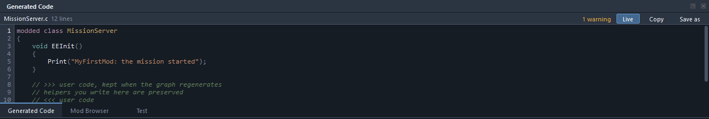

> EEInit() cannot be overridden here: MissionServer does not declare it. The
> method is generated without override, so the engine will never call it. Remove
> the node, or change the class this script extends.

Look at line 3 in that picture. There is no `override` on it, and that is the
tell: an event the class really has always generates `override void`. A
mission-layer class wants `OnInit` on `MissionServer`. Take the event from the
Events panel rather than placing a Begin node, and this cannot happen: the list
only offers hooks the class actually inherits.

**4. Two event nodes are fighting over one method.** New script writes a skeleton
with the override already in it, so a class opened for the first time already has
its event node. The Events panel refuses to add a duplicate; the Node Palette and
the right-click search do not check. With two on the canvas the generator emits
one method between them and warns, and the one that wins may be the empty one.
The whole of your graph then generates as a method that does nothing.

The tell is on the Generated Code dock's own bar, on the right, where it usually
says `No warnings`:

> OnInit() is driven by two event nodes, so only the first is emitted. Chain both
> from one node instead.

Look at the code. If the statement you wired is not in it, find the second event
node in the **Graph Outliner**, which lists both under the same name, and delete
it. Then wire what you meant to wire onto the one that is left.

**5. A dependency is in the chain after the mod that needs it.** The engine loads
`-mod=` left to right. A mod that loads before something it needs does not
complain. Use **Choose mods...**, which sorts the chain from what each mod
declares.

### Build PBO is greyed out

`P:` is not mounted, or the mod is not junctioned into it. The checklist under the
buttons in the Test dock names which. **Set up work drive**, `Ctrl+Shift+P`, makes
the link. `subst P: <your work drive folder>` mounts the drive, and it does not
survive a reboot.

### AddonBuilder cannot find a path

The junction points somewhere else, or the mod folder moved after it was made.
The Work drive link row in the checklist prints what `P:\<Prefix>` points at
right now, which is usually enough to see it.

### It refuses to create a mod on P:

That is deliberate, and the message says why. See [the work drive](#the-work-drive).
Create the mod somewhere ordinary and let `P:` point at it.

### Offline refuses to launch

> No mission to run. Offline loads one mission folder, and there is no
> MyFirstMod.\<map\> under ...\MyFirstMod\Missions to load. Scaffold the mod again
> with a map selected, or run on a dev server instead.

The mod was created with missions turned off. Either create it again with a map
ticked, or switch to the dev server, which leaves the mission to the `server.cfg`
in the mod's Workbench folder.

### It works offline and breaks on a server

Read the offline list in [section 8](#offline), starting with the Community
Online Tools permissions line. Offline is one process and is not multiplayer, so
every check that asks "am I on a server" answers differently there.

### The application will not start

It says so, in a box, before any window opens:

> Could not load the node catalogue.
>
> resources/catalog.json was not found.

The `resources` folder has to sit next to `DAYZSUDONodeMod.exe`. Unpack the whole
ZIP rather than just the executable. A second line in place of that one, naming a
parse error rather than a missing file, means the file is there and damaged:
unpack the ZIP again.

### A script came back with every line changed

Report it. A file this tool generated has to come back byte for byte, and a
diff over your whole mod is a defect rather than a setting.

---

## 10. Where to go next

| | |
| --- | --- |
| [examples/](examples/) | Four more worked graphs with the script each one generates, and [first-mod.sdzn](examples/first-mod.sdzn), the graph built above |
| [node-reference.md](node-reference.md) | Every node family, when to reach for each, and the cautions they carry |
| The Templates on the start page | Whole mods that already work on a server, as graphs you can read and edit |
| The Mod Browser | Every mod installed on your own machine, as graphs, read only |
| [architecture.md](architecture.md) | How the parts fit together, if you want to change one |

The single best next move is the Mod Browser. Open a mod you already use, find
the class behind the feature you like, and read it. That is the loop this tool
exists to shorten.
